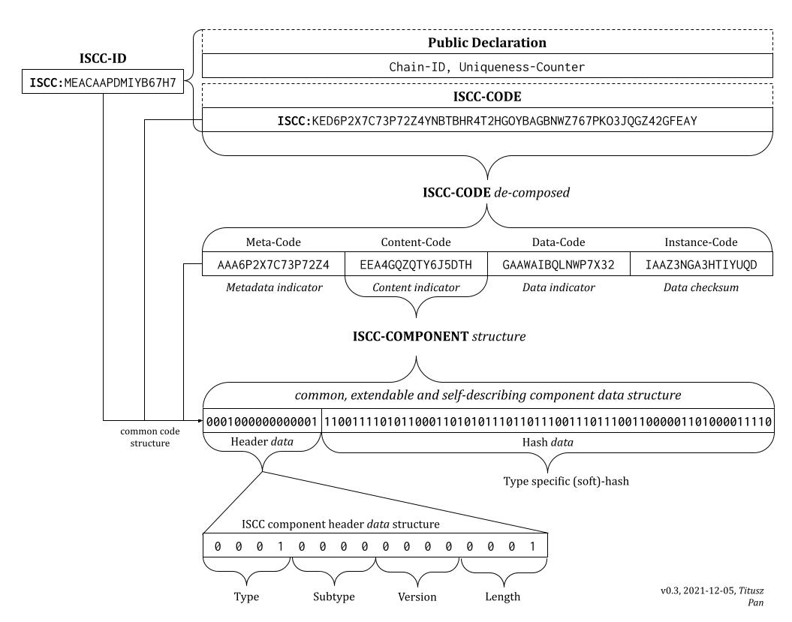

# iscc-core - ISCC Core Algorithms

[](https://github.com/iscc/iscc-core/actions/workflows/tests.yml)

> **iscc-core** is a Python library that implements the core algorithms of [ISCC v1.1](https://iscc.codes)
(International Standard Content Code)

## What is ISCC

The **ISCC** (*International Standard Content Code*) is an identifier for digital media
assets.

An **ISCC** is derived algorithmically from the digital content itself, just like
cryptographic hashes. However, instead of using a single cryptographic hash function to
identify data only, the ISCC uses a variety of algorithms to create a composite
identifier that exhibits similarity-preserving properties (soft hash).

The component-based structure of the ISCC identifies content at multiple levels of
abstraction. Each component is self-describing, modular and can be used separately or
in conjunction with others to aid in various content identification tasks.

The algorithmic design supports scenarios that require content deduplication, database
synchronisation and indexing, integrity verification, timestamping, versioning, data
provenance, similarity clustering, anomaly detection, usage tracking, allocation of
royalties, fact-checking and general digital asset management use-cases.

## What is `iscc-core`

`iscc-core` is the python based library of the core algorithms to create standard
compliant **ISCC** codes. It also serves as a reference for porting ISCC to other
programming languages.

## ISCC Architecture



## Installation

Use the package manager [pip](https://pip.pypa.io/en/stable/) to install `iscc-core`.

```bash
pip install iscc-core
```

## Quick Start

```python
from iscc_core import (
    Code,
    gen_meta_code,
    gen_image_code,
    gen_data_code,
    gen_instance_code,
    compose,
)

image_path = "../docs/images/iscc-architecture.png"

meta_code = Code(
    gen_meta_code(title="ISCC Architecure", extra="A schematic overview of the ISCC")
)
print("Meta-Code:\t\t", meta_code)
print("Structure:\t\t", meta_code.explain, end="\n\n")

with open(image_path, "rb") as stream:

    image_code = Code(gen_image_code(stream))
    print("Image-Code:\t\t", image_code)
    print("Structure:\t\t", image_code.explain, end="\n\n")

    stream.seek(0)
    data_code = Code(gen_data_code(stream))
    print("Data-Code:\t\t", data_code)
    print("Structure:\t\t", data_code.explain, end="\n\n")

    stream.seek(0)
    instance_code = Code(gen_instance_code(stream))
    print("Instance-Code:\t", instance_code)
    print("Structure:\t\t", instance_code.explain, end="\n\n")

iscc_code = compose((meta_code, image_code, data_code, instance_code))
print("Canonical ISCC:\t ISCC:{}".format(iscc_code.code))
print("Structure:\t\t", iscc_code.explain)
```

The output of this example is as follows:

```
Meta-Code:       AAA5H3V6SZHWDUKX
Structure:       META-TEXT-V0-64-d3eebe964f61d157

Image-Code:      EEA34YXAFUJWOZ5Q
Structure:       CONTENT-IMAGE-V0-64-be62e02d136767b0

Data-Code:       GAA6JYHWISAVU77Z
Structure:       DATA-NONE-V0-64-e4e0f644815a7ff9

Instance-Code:   IAAUULVLVWQLXSEM
Structure:       INSTANCE-NONE-V0-64-4a2eabada0bbc88c

Canonical ISCC:  ISCC:KED5H3V6SZHWDUKXXZROALITM5T3BZHA6ZCICWT77FFC5K5NUC54RDA
Structure:       ISCC-IMAGE-V0-256-d3eebe964f61d157be62e02d136767b0e4e0f644815a7ff94a2eabada0bbc88c
```

## Documentation

https://iscc-core.iscc.codes

## Project Status

ISCC is in the process of being standardized within
[ISO/TC 46/SC 9](https://www.iso.org/standard/77899.html).

## Maintainers
[@titusz](https://github.com/titusz)

## Contributing

Pull requests are welcome. For major changes, please open an issue first to discuss
what you would like to change. Please make sure to update tests as appropriate.

You may also want join our developer chat on Telegram at <https://t.me/iscc_dev>.


## Changelog

### [0.1.1] - 2021-11-14
- Fix packaging problems

### [0.1.0] - 2021-11-13
- Initial release


