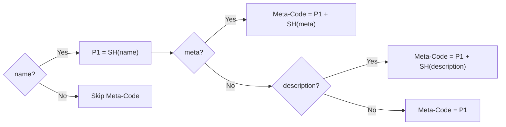
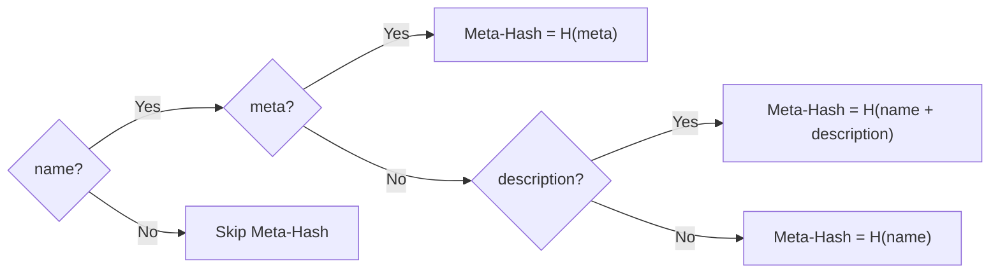

# **ISCC** - Meta-Code

*A similarity preserving hash for digital asset metadata*.

## Purpose

The Meta-Code is the first possible (optional) unit of an ISCC-CODE. It is calculated from the
metadata of a digital asset. The primary purpose of the Meta-Code is to aid the discovery of
digital assets with similar metadata and the detection of metadata anomalies. As a secondary
function, Meta-Code processing also creates a secure Meta-Hash for cryptogrpahic binding purposes.

## Inputs

The metadata supplied for Meta-Code calculation is called **Seed-Metadata**.
Seed-Metadata has 3 possible elements:

- **name** (required): The name or title of the work manifested by the digital asset.
- **description** (optional): A disambiguating textual description of the digital asset.
- **metadata** (optional): Industry-sector or use-case specific metadata, encoded as
    Data-URL ([RFC-2397](https://datatracker.ietf.org/doc/html/rfc2397)).

!!! note

    Due to the broad applicability of the ISCC we do not prescribe a particular schema for the
    supplied `metadata`. But we use the Data-URL format because it can encode and self-describe
    any conceivable metadata in a sufficently machine-interpretable form at any desired specificity.

    **Data-URL Examples**:

    - Metadata is "some" JSON: `data:application/json;base64,<data>`
    - Metadata is JSON-LD: `data:application/ld+json;base64,<data>`
    - Metadata is "some" XML: `data:application/xml;base64,<data>`
    - Metadata is MARC21 XML: `data:application/marcxml+xml;base64,<data>`
    - Metadata is IPTC NewsML: `data:application/vnd.iptc.g2.newsitem+xml;base64,<data>`

    Data-URLs are also supported by all major internet browsers.

## Processing

### Meta-Code

The first 32-bits of a Meta-Code are calculated as a simliarity hash from the `name` field.
The second 32-bits are also calculated from the `name` field if no other input was supplied.
If `description` is suplied but no `metadata`, the `description` will be used for the second
32-bits. If `metadata` is supplied it will be used in favour of `description` for the second
32-bits.

!!! note
    To support automation and reproducibility, applications that generate ISCCs, should
    prioritize metadata that is automatically extracted from the digital asset.

    If embedded metadata is not available or known to be unreliable an application should rely on
    external metadata or explicitly ask users to supply at least the `name`-field. Applications
    should then **first embed metadata** into the asset **before calculating
    the ISCC-CODE**. This ensures that the embedded metadata is bound to the asset by the
    Instance-Code.

    If neither embedded nor external metadata is available, the application may resort to use the
    filename of the digital asset as value for the `name`-field. If no value can be determined for
    the `name`-field, an application shall skip generation of a Meta-Code and create an ISCC-CODE
    without a Meta-Code.

### Meta-Hash

In addition to the Meta-Code we also create a cryptographic hash (the Meta-Hash) of the supplied
Seed-Metadata. It is used to securely bind metadata to the digital asset.

## Functions

::: iscc_core.code_meta
    selection:
        members:
            - gen_meta_code_v0
            - soft_hash_meta_v0
            - text_clean
            - text_remove_newlines
            - text_trim
    rendering:
        show_source: true

